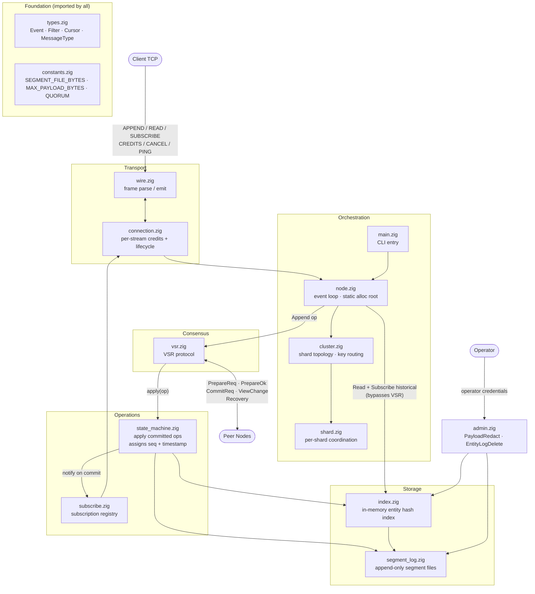

# Module Diagram

## Key design points

- **`state_machine.zig` is the VSR/storage seam.** The only code that assigns seq numbers; I-1/I-2/I-3 assertions live here and in `segment_log.zig`.
- **Reads bypass VSR entirely.** `node.zig` goes straight to `index.zig` → `segment_log.zig` with no consensus round-trip.
- **Subscribe has two phases.** Historical catch-up is a direct storage read (same path as Read). Live delivery is a `notify` callback from `state_machine.zig` on each commit, routed through `subscribe.zig` → `connection.zig`.
- **Admin is isolated from the client protocol.** The only entry point is `Operator → admin.zig`; there is no wire-layer path to these operations.
- **`sim/` is not shown.** It is a parallel build target that replaces the I/O layer under `vsr.zig` and `node.zig` with deterministic fakes; it does not add new module-level dependencies.
